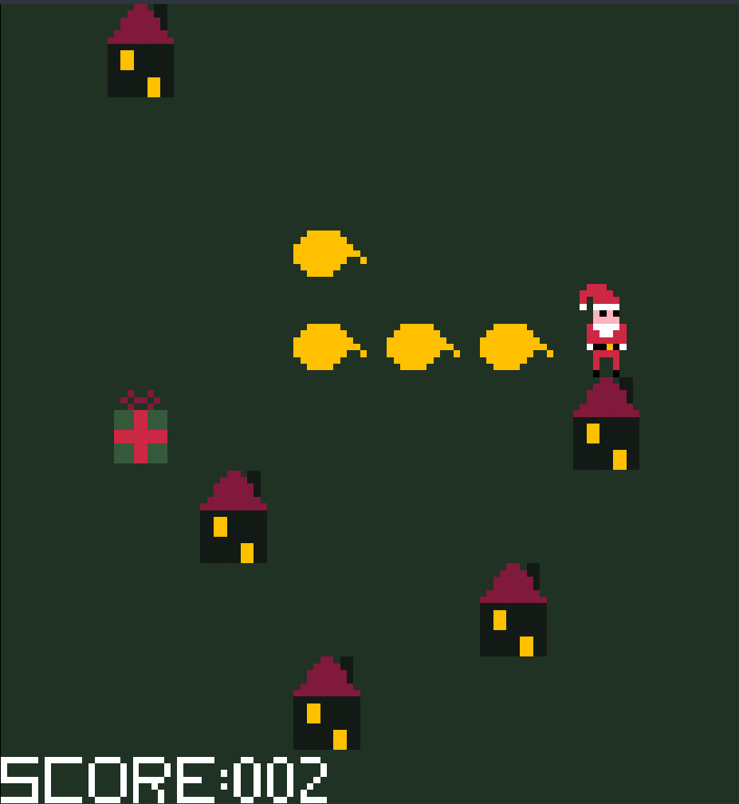

# Cozy Christmas

A Christmas themed snake-like game where you play as Santa picking up presents
and delivering them to each house.

## How to play the game?

You can move Santa using either the arrow keys or WASD. The aim of the game is
to pick up and deliver as many presents as possible, if you reach 99 delivered
presents you win!

## Prerequisites

-   Linux
-   Make
-   Clang
-   [SDL2](https://wiki.libsdl.org/SDL2/Installation)
    -   [SDL_image 2.0](https://wiki.libsdl.org/SDL2_image/FrontPage)
    -   [SDL_mixer 2.0](https://wiki.libsdl.org/SDL2_mixer/FrontPage)

## Building the game

To build the game you can simply run `make` for the release version and
`make debug` for the debug version.

## Screenshot

